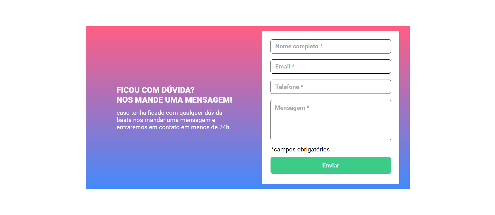

# 📄 Formulário com Validação

Este projeto consiste em um **formulário interativo** com validação de campos obrigatórios, desenvolvido utilizando **HTML, CSS e JavaScript**. Ele garante que os usuários preencham corretamente os campos antes de enviar a mensagem.

## 📚 Tecnologias Utilizadas

- HTML5
- CSS3
- Google Fonts
- JavaScript

## 📂 Estrutura do Projeto

```
/
├── .vscode/
├── src/
│   ├── css/
│   │   ├── reset.css
│   │   ├── style.css
│   ├── images/
│   ├── js/
│   │   ├── index.js
├── index.html
├── README.md
```

## 💡 Funcionalidades

- Validação de campos obrigatórios (Nome, Email, Telefone e Mensagem)
- Exibição de mensagens de erro para campos não preenchidos
- Design responsivo

## 🛠 Como Executar o Projeto

1. Clone o repositório:
   ```sh
   git clone https://github.com/alanborgesdev/formulariocomvalidacao
   ```
2. Acesse a pasta do projeto:
   ```sh
   cd nome-do-repositorio
   ```
3. Abra o arquivo `index.html` em um navegador.

## 📸 Screenshot



## 🤝 Contribuição

Se quiser contribuir com melhorias:

1. Faça um fork do repositório.
2. Crie uma branch com sua funcionalidade: `git switch -c minha-nova-feature`.
3. Commit suas alterações: `git commit -m "Adicionei uma nova feature"`.
4. Faça um push para a branch: `git push origin minha-nova-feature`.
5. Abra um Pull Request.

Agradecemos sua ajuda! 😉

## 💎 Autor

Criado por **[Alan Borges](https://github.com/alanborgesdev)** 🚀
